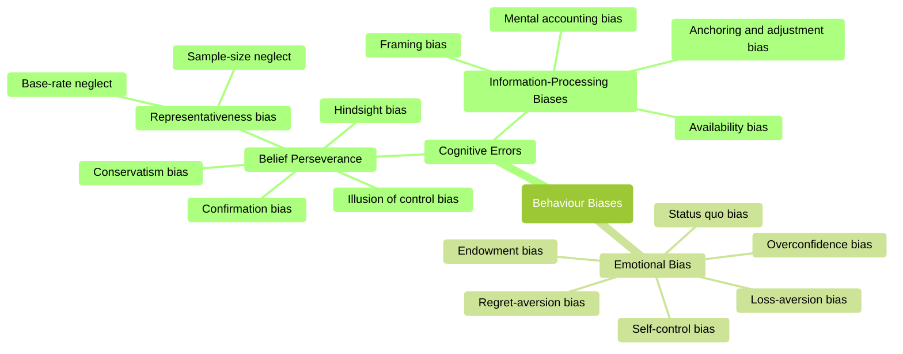

```mermaid
%%{init: {'theme':'forest'}}%%
mindmap
    root(Behaviour Biases)
        Cognitive Errors
            Belief Perseverance
                Conservatism bias
                Confirmation bias
                Representativeness bias
                    Base-rate neglect
                    Sample-size neglect
                Illusion of control bias
                Hindsight bias
            Information-Processing Biases
                Anchoring and adjustment bias
                Mental accounting bias
                Framing bias
                Availability bias
        Emotional Bias
            Loss-aversion bias
            Overconfidence bias
            Self-control bias
            Status quo bias
            Endowment bias
            Regret-aversion bias
```
